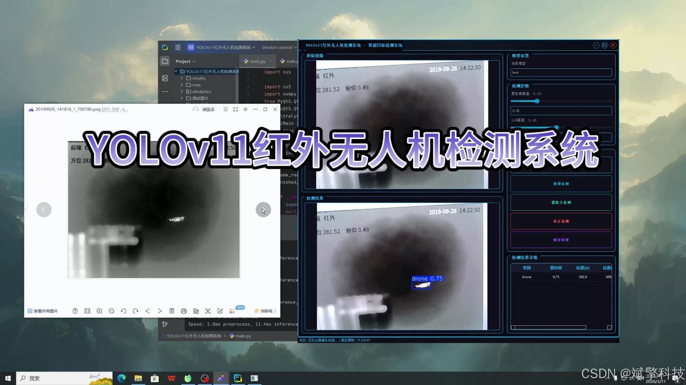
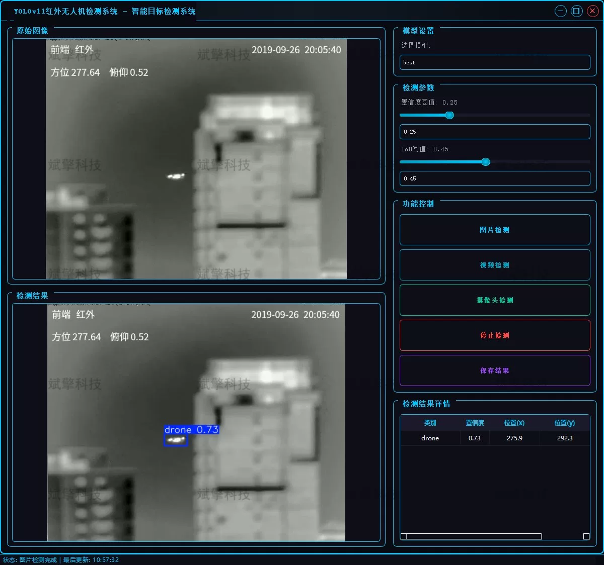
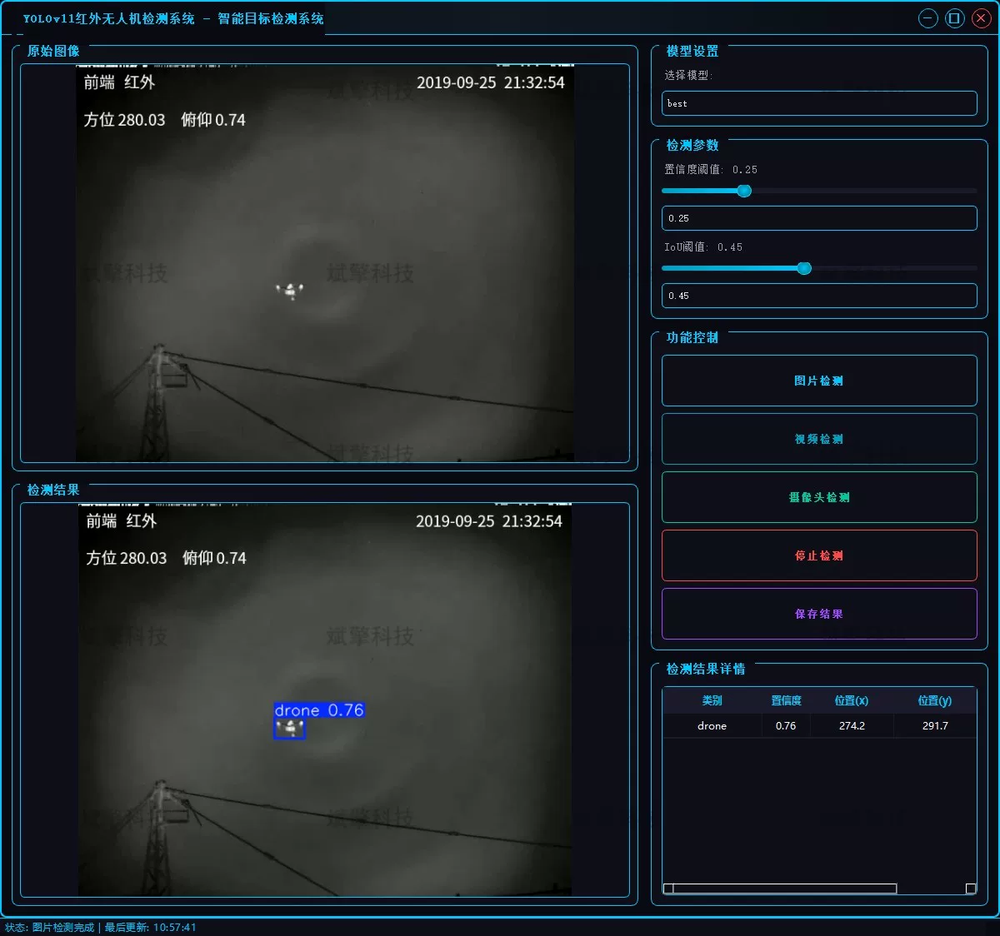
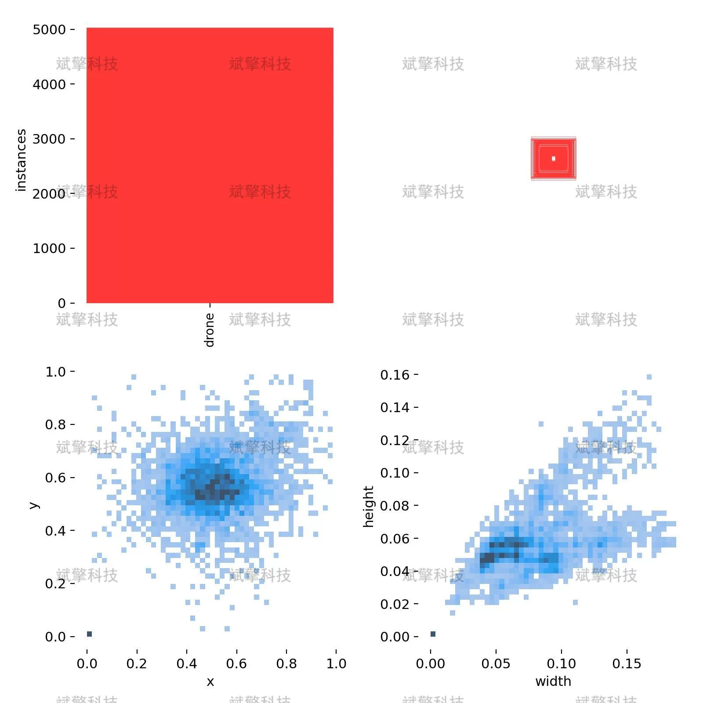

# YOLOv11 Infrared Drone Detection System

## Body

YOLOv11 Infrared Drone Detection System Based on YOLOv11 Deep Learning for Infrared Drone Recognition and Detection (YOLOv11+YOLO dataset + UI interface + login registration interface + Python project source code + model)

This project is based on the latest YOLOv11 deep learning algorithm to build a high-performance infrared drone detection system. The system has been specially optimized for low contrast of infrared images and blurry target textures, capable of achieving precise recognition and localization of drone targets in real-time infrared video streams.

The system provides a graphical user interface that supports three detection modes: static images, offline videos, and real-time camera video streams. It features fast detection speed, low false alarm rate, and flexible deployment, providing an efficient and reliable intelligent technical solution for the safety supervision of low-altitude airspace.

Project Functionality Display

✅ User Login and Registration: Supports password verification and security validation.

✅ Three Detection Modes: Based on the YOLOv11 model, supports image, video, and real-time camera detection, with accurate target recognition.

✅ Dual-Screen Comparison: Displays the original scene and detection results on the same screen.

✅ Data Visualization: Real-time table displays the category, confidence, and coordinates of detected targets.

✅ Intelligent Parameter Tuning: Offers a confidence slide bar to dynamically optimize detection accuracy, adapting to different scene requirements.

✅ Sci-Fi Interactive Interface: Dark theme combined with dynamic light effects, reducing visual fatigue and improving operational experience.

✅ Multi-Thread High-Performance Architecture: Independent detection threads ensure smooth operation, real-time status prompts, and rapid response without lag.

Dataset Introduction

Training set (Train): A total of 5019 images
Validation set (Val): A total of 1233 images

## Images

## Payment

Here is a pay link on Stripe ( https://buy.stripe.com/3cs8yP7sY87d0vu9AB ). Please contact me lonlonago@foxmail.com after funding $89, and I will send you a complete data files , thank you!

